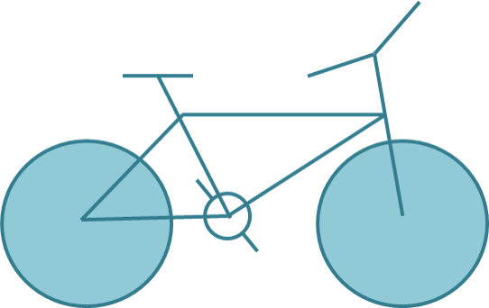
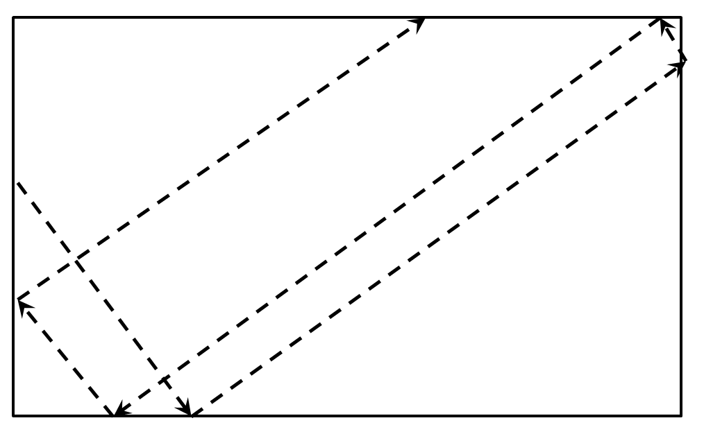

#HTML5 Canvas Practise Tasks:

##Task 1
**Optional, no points, no deadline**
Draw the following using canvas: 

##Task 2
**Optional, no points, no deadline**

`Draw a circle that flies inside a box

*   When it reaches an edge, it should bounce that edge
*   _Example:_

##Task 3
**Optional, no points, no deadline**

Create the famous game "Snake"
*   The snake is a sequence of rectangles/ellipses
*   The snake can move left, right, up or down
*   The snake dies if it reaches any of the edges or when it tries to eat itself
*   A food should be generated
    *   When the snake eats the food, it grows and new food is generated at random position
*   Implement a high-score board, kept in localStorage
