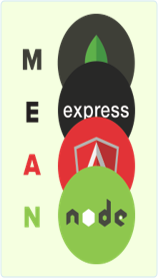
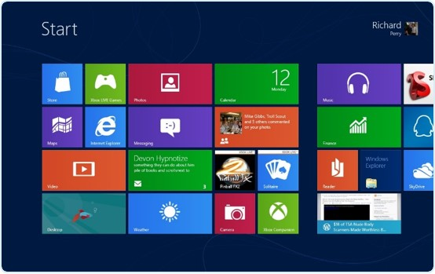

#Scallable Vector Graphics Prectise Tasks:

##Task 1
**Optional, no extra points, no deadline**

Define the MEAN image using SVG
*   Use both circles and paths

##Task 2
**Optional, no extra points, no deadline**

Define the Windows 8 image using SVG

##Task 3
**Optional, no extra points, no deadline**

Implement the previous tasks using the **SVG DOM API** for JavaScript