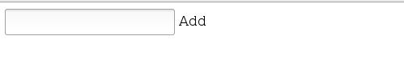
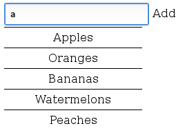
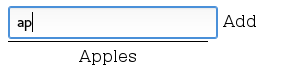
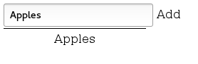
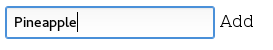
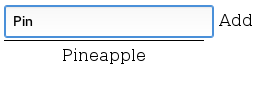

# Task 1 - Autocomplete

##  Task overview

Create a function that, by a given array of strings, creates an autocomplete dropdown list

*   The function takes two parameters:
    *   A **selector** that can be any CSS3 selector: 
        *   By id -`#id`
        *   By class - `.class`
        *   By node type - `div`
        *   Or nested selectors - `#this .is a .nested.selector`
    *   A suggestions array
        *   Array of strings
        *   **optional**, may not be provided

The following must be implemented:

*   Adding a suggestion for each element from the suggestions array 
*   Entering a string for autocomplete
    *   Any suggestion that does not contain the autocomplete string must be hidden
    *   When the autocomplete string is empty, all suggestions must be hidden
*   Adding a new string for suggestion
    *   Clicking the "Add" button, must add the string from the autocomplete to the suggestions
        *   If the new suggestion is already contained in the suggestions, skip it
        *   A suggestion can be contained only once
*   Selecting a suggestion
    *   Selecting a suggestion from the suggestions must be filled in the autocomplete input

##  Task requirements

1.  Use the HTML from the `index.html` file
2.  Each suggestion must have the following HTML:

    ```html
    <li class="suggestion">
        <a href="#" class="suggestion-link">Apple</a>
    </li>
    ```

##  Solution template and submission:

-   Use the following submission template:

```js
function solve(){
    return function(selector, suggestionsArray){
        //your code here
    };
}
```

-   Submit it in http://bgcoder.com  

### Example usage 1:

```html
<div class="autocomplete">
    <input class="tb-pattern" type="text" />
    <a href="#" class="btn-add">Add</a>
    <ul class="suggestions-list">
    </ul>
</div>
<script>
solve()("#root", ["Apples", "Oranges"]);
</script>
```

### Example usage 2:

```html
<div class="autocomplete">
    <input class="tb-pattern" type="text" />
    <a href="#" class="btn-add">Add</a>
    <ul class="suggestions-list">
    </ul>
</div>
<script>
solve()("#root");
</script>  
```

##  Examples:

-   Autocomplete string is empty
    -   No suggestions are shown



-   Autocomplete string is "a"
    -   Some suggestions are shown



-   Autocomplete string is "ap"
    -   Some suggestions are shown



-   The autocomplete string becomes "Apples" after the "Apples" suggestion is clicked



-   No suggestion matches the autocomplete srtring "Pineapple"
    -   No suggestions are shown

  

-   After clicking the "Add" button the new suggestion "Pineapple" is added



##  Additional Requirements

-   You are **NOT** allowed to alter the HTML or the CSS in any way
    -   Keep in mind, the tests use the original HTML and CSS
-   Write all your code only in the `task-1.js` file
-   Mandatory hide elements with `display: none`
-   Use `input` event on the autocomplete `<input />`