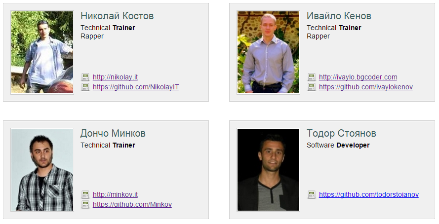

#Task 3: Trainers List template

* Given the HTML (index.html), CSS (styles.css), JavaScript (scripts.js) and images build a **Handlebars.js template** that produces the HTML in `result.html`
  * You should only fill the template in the element with id `authors-template`
  * Note that in the result some html elements have `right` class and others don’t
  
* _Example:_
  
  
* Constraints:
  * You are allowed only to edit the contents of the file "index.html " and only the template inside the element with ID "authors-template"
  * You are NOT allowed to edit the contents of the JavaScript and/or the CSS files