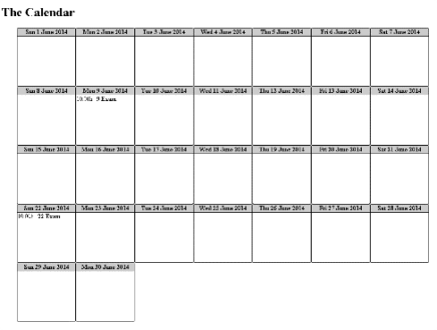

#Task 1 - Calendar

* Create a calendar using pure (vanilla) JavaScript
* Given the HTML file (`index.html`) create a JavaScript function `createCalendar(selector, events)`
  * `selector` is a `string` that contains a **DOM selector**
    * Valid selectors are all CSS3 selectors: '.class', '#id', '#parent .item'
  * `events` is an **array of objects**, following the structure
  
        var events = [{
          title: 'JavaScript UI & DOM exam", //a regular string
          date: 17, //a number between 1 and 30 inclusive
          time: '10:00', //a string in the format "HH:MM"
          duration: 360 //a positive number less than 1440 (24 hours * 60 minutes)
        }, {
          //
        }];    
    * Events should be added into the *day box* for the day in the `event.date` property
  * The `createCalendar()` function should add the calendar into the control, represented by the selector
  * As a result must look like the following:
    
    
    
    
* The calendar should support the following functionality:
  * Hover on a day changes the background of the title  
  * Click on a day changes the color of the whole day element
    * Only one element can be selected at once
     
* Constraints:
  * No CSS allowed, all the styles should be applied with JavaScript
  * The calendar is always for **June 2014**
  * There will be no more than a **single event for a date**
