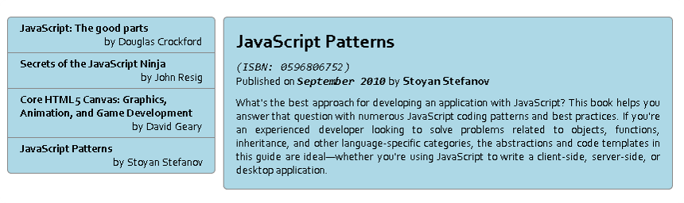

#Task 3 - Books

* Given the HTML (`index.html`), CSS (`styles.css`) and JavaScript (`scripts.js`) build a template that produces the HTML in `result.html`
  * You should **only fill the templates** in the elements with ids `books-list-template` and `book-details-template`

* _Example:_
  
