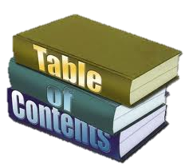
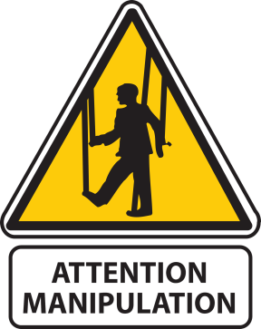

<!-- section start -->
<!-- attr: { hasScriptWrapper:true, class:"slide-title" } -->
# jQuery Overview
## Unleash the Power of jQuery
<!--  -->
<!--  -->
<!--  -->
<!--  -->
<!--  -->

<aside class="signature">
  <p class="signature-course">JavaScript DOM & UI</p>
	<p class="signature-initiative">Telerik Software Academy</p>
	<a href="http://academy.telerik.com " class="signature-link">http://academy.telerik.com </a>
</aside>


<!-- section start -->
<!-- attr: { hasScriptWrapper:true, style:'' } -->
# Table of Contents
- [What is jQuery?](#whatis-jquery)
- jQuery Fundamentals
  - [Selectors](#selectors)
  - [DOM Manipulation](#dom-manipulation)
  - [jQuery DOM elements](#jquery-objects)
  - [jQuery Objects and Events](#objects-events)
- [AJAX](#jquery-ajax)
  - jQuery AJAX Methods
  - Executing AJAX Requests
  
<!--  -->

<!-- section start -->
<!-- attr: { id:'whatis-jquery', class:'slide-section', showInPresentation:true, hasScriptWrapper:true, style:'' } -->
<!-- # What is jQuery?
## The world’s most popular JavaScript library -->


<!-- attr: { showInPresentation:true, hasScriptWrapper:false, style:'' } -->
# What is jQuery?
- jQuery is a cross-browser JavaScript library 
  - Designed to simplify the client-side scripting of HTML
  - The most popular JavaScript library in use today
  - Free, open source software
- jQuery's syntax is designed to make it easier to
  - Navigate a document and select DOM elements 
  - Create animations
  - Handle events


<!-- attr: { showInPresentation:true, hasScriptWrapper:false, style:'' } -->
- jQuery also provides capabilities for developers to create plugins for
  - Low-level interaction and animation
  - Advanced effects and high-level, theme-able widgets
  - Creation of powerful and dynamic web pages
- Microsoft adopted jQuery within Visual Studio
  - Uses in Microsoft's ASP.NET AJAX Framework and ASP.NET MVC Framework


<!-- attr: { showInPresentation:true, hasScriptWrapper:false, style:'' } -->
# Why jQuery is So Popular?
- Easy to learn 
  - Fluent programming style
- Easy to extend
  - You create new jQuery plugins by creating new JavaScript functions
- Powerful DOM Selection 
  - Powered by CSS 3.0
- Lightweight
- Community Support 
  - Large community of developers and geeks


<!-- attr: { showInPresentation:true, hasScriptWrapper:true, style:'' } -->
# How to Add jQuery<br/>to a Web Site?
- Download jQuery files from [jquery.com](http://www.jquery.com)
- Self hosted
  - You can choose to self host the **.js** file
  - E.g. **jquery-3.1.0.js** or **.min.js** file
- Use it from CDN (content delivery network)
  - Microsoft, jQuery, Google CDNs
  - e.g. [code.jquery.com/jquery-3.1.0.min.js](https://code.jquery.com/jquery-3.1.0.min.js)
  - [ajax.microsoft.com/ajax/jquery/jquery-3.1.0.min.js](http://ajax.microsoft.com/ajax/jquery/jquery-3.1.0.min.js)


<!-- section start -->
<!-- attr: { id:'selectors', class:'slide-section', showInPresentation:true, hasScriptWrapper:true, style:'' } -->
<!-- # Selectors and DOM Manipulation -->
<!--  -->
<!--  -->

<!--  -->


<!-- attr: { id:'', class:'', showInPresentation:true, hasScriptWrapper:false, style:'font-size:0.9em' } -->
# Selectors
- Selection of DOM elements in jQuery is much like as in pure JavaScript
  - Selection of elements using CSS selectors
  - Like querySelectorAll

```javascript
$(selector)
```

```javascript
//by tag
$("div") //document.querySelectorAll("div");
//by class
$(".menu-item") 
//document.querySelectorAll(".menu-item");
//by id
$("#navigation")
//by combination of selectors
$("ul.menu li")
```

<!-- attr: { showInPresentation:true, hasScriptWrapper:false, style:'' } -->
# Selection with jQuery
- Selecting items with jQuery
  - Almost always returns a collection of the items
    - Even if there is only one item
  - Can be stored in a variable or used right away
  - The usage of the elements is always the same, no matter whether a single or many elements
- More at: [learn.jquery.com](http://learn.jquery.com/using-jquery-core/selecting-elements)

```javascript
// select the item
$("#something").hide();
$(".widgets").fade(1);
```

<!-- attr: { class:'slide-section demo', showInPresentation:true, hasScriptWrapper:true, style:'' } -->
<!-- # Selection with jQuery
## [Demo]() -->


<!-- attr: { id:'dom-manipulation', class:'', showInPresentation:true, hasScriptWrapper:false, style:'' } -->
# DOM Traversal
- As with plain JavaScript, the DOM can be traversed with jQuery
  - Properties for:
    - Next and previous siblings
    - Parents and children


<!-- attr: { id:'', class:'', showInPresentation:true, hasScriptWrapper:true, style:'' } -->
# DOM Traversal: Next and Previous
- `jQuery.next()`, `jQuery.prev()`
  - Returns the next/prev sibling
  - Returns an HTML element
    - Not a `[text]` node

<!-- attr: { id:'', class:'', showInPresentation:true, hasScriptWrapper:true, style:'' } -->
# DOM Traversal: Next and Previous
```javascript
<ul>
  <li>Item 1</li>
  <li>Item 2</li>
</ul>
```
```javascript
var $first = $("li").first();
log($first);
//logs "Item 1"
log($first.next());
//logs "Item 2"
```

<!-- attr: { id:'', class:'', showInPresentation:true, hasScriptWrapper:true, style:'' } -->
# DOM Traversal: Parent
- `jQuery.parent()`
  - Returns the parent of the element
- `jQuery.parents(selector)`
  - Returns the first parent that matches the selector

<!-- attr: { id:'', class:'', showInPresentation:true, hasScriptWrapper:true, style:'' } -->
# DOM Traversal: Parent
```html
<div id="wrapper">
 <ul id="items-list">
  <li>Item 1</li>
  <li>Item 2</li>
  <li class="special">Item 3</li>
  <li>Item 4</li>
 </ul>
</div>
```

```javascript
var $node = $(".special");
$node.parent().attr("id"); //logs "items-list"
$node.parents("div").attr("id");
//logs "wrapper"
$node.parents("#wrapper")     .attr("id");
/logs "wrapper"
```

<!-- attr: { class:'slide-section demo', showInPresentation:true, hasScriptWrapper:true, style:'' } -->
<!-- # DOM Traversal
## [Demo]() -->


<!-- attr: { id:'', class:'', showInPresentation:true, hasScriptWrapper:true, style:'' } -->
# Adding Elements
- Adding elements can be done on the fly
  - `jQuery.appendTo()`/`prependTo()`
  - `jQuery.append()`/`prepend()`

```
$("<ul><li>Hello</li></ul>").appendTo("body");
$("body").prepend("<h1>header</h1>");
```
- Creating new elements is also easy

```
var $divElement = $('<div>');
var $anotherDivElement = $('<div />');
```
<!--  -->

<!-- attr: { class:'slide-section demo', showInPresentation:true, hasScriptWrapper:true, style:'' } -->
<!-- # Adding Elements to the DOM
## [Demo]() -->

<!-- attr: { id:'', class:'', showInPresentation:true, hasScriptWrapper:true, style:'' } -->
# Removing Elements
- You can also remove elements from the DOM
  - Just as easy

```html
// Before
<div>
  <p>Red</p> 
  <p>Green</p>
</div>
```
```javascript
// Removing elements
$('p').remove();
```

```html
// After
<div>
</div>
```

<!-- attr: { id:'', class:'slide-section demo', showInPresentation:true, hasScriptWrapper:true, style:'' } -->
<!-- # Removing Elements
## [Demo]() -->
<!--  -->
<!--  -->
<!--  -->


<!-- section start -->
<!-- attr: { id:'objects-events', class:'slide-section', showInPresentation:true, hasScriptWrapper:true, style:'' } -->
<!-- # jQuery
## Objects and Events -->


<!-- attr: { id:'jquery-objects', class:'', showInPresentation:true, hasScriptWrapper:false, style:'' } -->
# jQuery Objects
- Selected with jQuery DOM elements are NOT pure DOM elements
  - They are extended
  - Have additional properties and methods
    - `addClass()`, `removeClass()`, `toogleClass()`
    - `on(event, callback)` for attaching events
    - `animate()`, `fade()`, etc…

```
//Parsing a regular DOM element to jQuery Element
var content = document.createElement("div");
var $content = $(content);
```

<!-- attr: { id:'', class:'', showInPresentation:true, hasScriptWrapper:true, style:'' } -->
# Properties of<br/>jQuery Elements
- jQuery elements extend regular DOM elements
- Methods for altering the elements
  - `jQuery.css("color", "#f3f")`
  - `jQuery.html()` returns the innerHTML
    - `jQuery.html(content)` sets the innerHTML
  - `jQuery.text(content)` sets the innerHTML, by escaping the content


<!-- attr: { id:'', class:'', showInPresentation:true, hasScriptWrapper:false, style:'' } -->
# jQuery Events
- jQuery has a convenient way for attaching and detaching events
  - Works cross-browser
  - Using methods **on()** and **off()**

```javascript
function onButtonClick(){
  $(".selected").removeClass("selected");
  $(this).addClass("selected");
}

$("a.button").on("click", onButtonClick);
```

<!-- attr: { id:'', class:'', showInPresentation:true, hasScriptWrapper:false, style:'' } -->
# jQuery Events
- Optimize the event
  - Add it on the parent element
  - A bit different syntax

```javascript
function onListItemClick(){
  $(".selected").removeClass("selected");
  $(this).addClass("selected");
}

$("ul").on("click", "li", onListItemClick);
```

<!-- attr: { id:'', class:'slide-section demo', showInPresentation:true, hasScriptWrapper:true, style:'' } -->
<!-- # jQuery Event Handlers
## [Demo]() -->


<!-- attr: { id:'', class:'', showInPresentation:true, hasScriptWrapper:true, style:'font-size:0.9em' } -->
# jQuery Chaining
- The chaining paradigm is as follows:
  - If a method should return **result** -> Ok, return **it**
  - If a method should **NOT return** a result -> return **this**
- jQuery implements this paradigm, so methods can be chained to one another:

```javascript
$('<button>')
  .addClass('btn-success')
  .html('Click me for success')
  .on('click', onSuccessButtonClick)
  .appendTo(document.body);
```

<!-- attr: { id:'', class:'slide-section demo', showInPresentation:true, hasScriptWrapper:true, style:'' } -->
<!-- # jQuery Chaining
## [Demo]() -->


<!-- section start -->
<!-- attr: { id:'jquery-ajax', class:'slide-section', showInPresentation:true, hasScriptWrapper:true, style:'' } -->
<!-- # jQuery AJAX -->


<!-- attr: { id:'', class:'', showInPresentation:true, hasScriptWrapper:false, style:'font-size:0.9em' } -->
# jQuery AJAX
- **AJAX** stands for **A**synchronous **J**avaScript **a**nd **X**ML
  - Meaning asynchronously get data from a remote place and render it dynamically
- jQuery provides some methods for AJAX
  - `jQuery.ajax(options)` – HTTP request with full control (headers, data, method, etc…)
  - `jQuery.get(url)` – HTTP GET request
  - `jQuery.post(url)` – HTTP POST request
  - `jQuery(selector).load(url)` – loads the contents from the url inside the selected node


<!-- section start -->
<!-- attr: { hasScriptWrapper:true, class:"slide-section", showInPresentation:true } -->
<!-- # jQuery Overview
## Questions? -->

<!-- attr: { showInPresentation: true, hasScriptWrapper: true, style:'font-size: 0.9em' } -->
# Free Trainings<br/>@ Telerik Academy
- "Web Design with HTML 5, CSS 3 and JavaScript" course @ Telerik Academy
    - [javascript course](http://academy.telerik.com/student-courses/web-design-and-ui/javascript-fundamentals/about)
  - Telerik Software Academy
    - [academy.telerik.com](academy.telerik.com)
  - Telerik Academy @ Facebook
    - [facebook.com/TelerikAcademy](facebook.com/TelerikAcademy)
  - Telerik Software Academy Forums
    - [forums.academy.telerik.com](http://telerikacademy.com/Forum/Home)

<!--  -->
