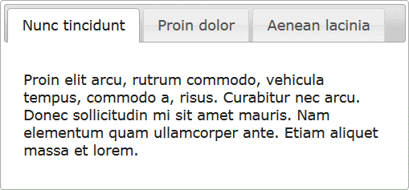

<!-- section start -->
<!-- attr: { id:'title', hasScriptWrapper:true, class:'slide-title' } -->
# jQuery Plugins
## Expanding the functionality of jQuery

<aside class="signature">
	<p class="signature-course">JavaScript DOM & UI</p>
	<p class="signature-initiative">Telerik Software Academy</p>
	<a href="http://academy.telerik.com" class="signature-link">http://academy.telerik.com</a>
</aside>


<!-- section start -->
<!-- attr: { id:'table-of-contents' } -->
# Table of Contents
- [jQuery Plugins](#jquery-plugin)
  - jQueryUI
- [Creating Custom Plugins](#creating-plugins)
  - Implementing chaining in plugins
- [Plugins Options](#plugins-with-options)


<!-- section start -->
<!-- attr: { id:'jquery-plugin', showInPresentation:true, class:'slide-section' } -->
<!-- # jQuery Plugins -->


# jQuery Plugin
- A Plugin is just a method that extends the jQuery objects prototype
  - Enabling all jQuery objects to use this method
- Once a plugin is imported, it is used as regular jQuery method
  - Like `addClass()`, `fadeout()` and `hide()`


<!-- attr: { showInPresentation:true, hasScriptWrapper:true } -->
<!-- # jQuery Plugins -->
- jQuery has many ready-to-use plugins
  - A library jQueryUI for UI controls
- Plugins for UI
  - Tabs
```javascript
$("#tabs-holder").tabs();
```
  - Arrangeable elements
```javascript
$("#grid" ).sortable();
```

<!--  -->
<!--  -->


<!-- attr: { showInPresentation:true, class:'slide-section demo' } -->
<!-- # jQuery Plugins
## [Demo]() -->


<!-- section start -->
<!-- attr: { id:'creating-plugins', showInPresentation:true, class:'slide-section' } -->
<!-- # Creating Custom jQuery Plugins -->


<!-- attr: { hasScriptWrapper:true } -->
# Creating jQuery Plugins
- jQuery has an easy way to extend the initial functionality with plugins
  - Just create a regular JavaScript method and attach it to **jQuery.fn** object

```javascript
(function($){
  $.fn.zoom = function(){    
    var $this = $(this);
    $this.on("mouseover", function() {
      //zoom in element
    });
    $this.on("mouseout", function() {
      //zoom out element
    });
  }
}(jQuery));
```

<span class="balloon fragment" style="top:85%; left:48%">`$(".image").zoom();`</span>


<!-- attr: { showInPresentation:true, class:'slide-section demo' } -->
<!-- # Zoom Plugin
## [Demo]() -->


<!-- attr: { hasScriptWrapper:true } -->
# Chaining in Plugins 
- Chaining is pretty good and useful feature
  - Better to be implemented in our plugins
  - Done easy, just return **this** at the end of the plugin function

```javascript
(function($){
  $.fn.zoom = function(){    
    var $this = $(this);
    $this.on('mouseover', function() {…});
    $this.on('mouseout', function() {…});
    return $this;
  }
}(jQuery));
```

<span class="balloon fragment" style="top:75%; left:48%; width:250px">
`$('.image')`<br/>`.zoom()`<br/>`.addClass('zoom');`</span>


<!-- attr: { class:'slide-section demo', showInPresentation:true } -->
<!-- # Chaining in Plugins 
## [Demo]() -->


<!-- section start -->
<!-- attr: { id:'plugins-with-options', class:'slide-section', showInPresentation:true } -->
<!-- # Plugins with Options
## Creating plugins more customizable -->


<!-- attr: { class:'' } -->
# Plugins with Options
- Plugins can also be provided with options
  - Just pass regular function parameters

```javascript
(function($){
  //zoom with size percents
  $.fn.zoom = function(size){    
    var $this = $(this);
    $this.on('mouseover', function() {…});
    $this.on('mouseout', function() {…});
    return $this;
  }
}(jQuery));
```


<!-- attr: { class:'slide-section demo', showInPresentation:true } -->
<!-- # Plugins with Options
## [Demo]() -->


<!-- attr: { class:'' } -->
# Plugins Options
- Yet the options sometimes become too many
  - When too many arguments, just use a options object
  - Give the options as a JSON-like object


<!-- attr: { showInPresentation:true, class:'slide-section demo' } -->
<!-- # Plugins with Options Object
## [Demo]() -->


<!-- section start -->
<!-- attr: { hasScriptWrapper:true, class:"slide-section", showInPresentation:true } -->
<!-- # jQuery Plugins
## Questions -->


<!-- attr: { showInPresentation: true, hasScriptWrapper: true, style:'font-size: 0.9em' } -->
# Free Trainings<br/>@ Telerik Academy
- "Web Design with HTML 5, CSS 3 and JavaScript" course @ Telerik Academy
    - [javascript course](http://academy.telerik.com/student-courses/web-design-and-ui/javascript-fundamentals/about)
  - Telerik Software Academy
    - [academy.telerik.com](academy.telerik.com)
  - Telerik Academy @ Facebook
    - [facebook.com/TelerikAcademy](facebook.com/TelerikAcademy)
  - Telerik Software Academy Forums
    - [forums.academy.telerik.com](http://telerikacademy.com/Forum/Home)

<!--  -->
