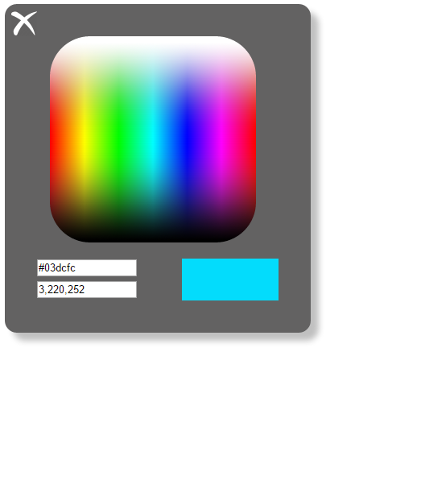

# jQuery Colorpicker

## Task 2

Create a jQuery plugin that turns a container element into a toggable colorpicker.

- Initially, the colorpicker panel should be hidden. There should be a button that opens the colorpicker panel:

- Clicking on the image button above should open the colorpicker panel like that:

- There should be a `close` button which hides the colorpicker panel.
- For the colorpicker image and colorpicking use `canvas` and the `canvas` API.
    - _Hint_: Research the `canvas.drawImage` method.
    - _Hint_: Research the `canvas.getImageData` method.
- When the canvas is clicked, the color on the mouse coordinates should be picked and displayed in:
    - The RGB input field.
    - The HEX input field.
    - In the `div` element in the bottom right corner of the panel, as background color.
    - _Bonus_: copy the hex value of the picked color to the clipboard.

- When the value in one of the input fields is changed, you should change the change the value of the other and the background color of the 
bottom right visualization div to the new value.
    - _Bonus_: copy the hex value of the new color to the clipboard.

### Submission
- You do not have to submit anything for this task. It's entirely optional.

### Guidelines
- Don't use inline styles. Use jQuery to attach classes and CSS to style the colorpicker.
- Attach events to parent elements for better performance.
- Some elements(like images) are loaded asynchrounosly by the browser. Use their `onload` event.
- Use semantic html.
- Try to use responsive design.
- Search the internet when you don't know how to do something.