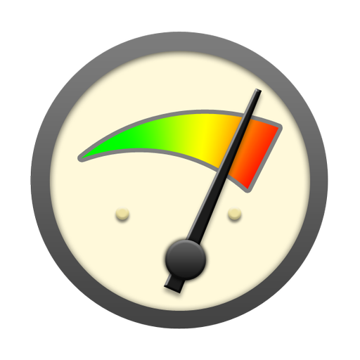

<!-- section start -->
<!-- attr: { hasScriptWrapper:true, id:"title", class:"slide-title" } -->
# DOM Performance
## How to write fast client-side JavaScript

<aside class="signature">
    <p class="signature-course">JavaScript DOM & UI</p>
    <p class="signature-initiative">Telerik Software Academy</p>
    <a href="http://academy.telerik.com" class="signature-link">http://academy.telerik.com</a>
</aside>

<!--  -->

<!-- section start -->
<!-- attr: { hasScriptWrapper: true, style: 'font-size: 0.8em' } -->
# Table of Contents
- [Creating DOM elements](#creating-elements)
- [Manipulating DOM elements](#manipulating-elements)
  - [Adding elements to the DOM](#adding-elements)
  - [Removing and manipulating elements](#removing-elements)
  - [Changing styles](#changing-styles)
- [Querying the DOM](#querying)
  - [Caching query results](#caching-results)
  - [Efficient selectors](#efficient-selectors)
- [Events](#events-performance)
  - [Delegation](#delegation)
  - [One-time events](#one-time-events)
  - [High-rate events](#high-rate-events)

<!--  -->


<!-- section start -->
<!-- attr: { id: 'creating-elements',class: 'slide-section', showInPresentation: true } -->
<!-- # <a id="creating-elements"></a>Creating DOM elements
## Using cloning for similar elements -->

<!-- attr: { style: 'font-size: 0.85em', showInPresentation: true } -->
# Using cloning for similar elements
- Use `node.cloneNode(true)` (**native**) or `$element.clone()` (**jQuery**) for better performance when creating many similar elements
- Only when there is a small difference between the elements
  - i.e. when many links have only different `href` and `innerHTML`
- [Read more](https://developer.mozilla.org/en-US/docs/Web/API/Node/cloneNode) about `node.cloneNode()`
- [Read more](https://api.jquery.com/clone/) about `$element.clone()`

<!-- section start -->
<!-- attr: { id: 'manipulating-elements', class: 'slide-section', hasScriptWrapper: true, showInPresentation: true } -->
<!-- # <a id="manipulating-elements"></a>Manipulating DOM elements
## Adding, removing and changing elements -->

<!-- attr: { id:'adding-elements' } -->
# <a id="adding-elements"></a>Adding elements to the DOM
- Do not directly append a lot of elements to the DOM, this will trigger a lot of browser redraws
- Changes to the DOM can trigger a browser redraws
  - Addition and removal of DOM elements
  - Change of certain attributes
  - Change of styles

<!-- attr: { showInPresentation: true } -->
<!-- # Adding elements to the DOM -->
- The following will trigger `1000` browser redraws:

```js
var list = document.getElementById('list'),
    count = 1000;

for(var i = 0; i < count; i += 1) {
    var li = document.createElement('li');
    li.innerHTML = 'Item #' + i;
    // each appending will trigger a redraw
    list.appendChild(li);
}
```

<!-- attr: { style: 'font-size: 0.9em' } -->
# Document fragments
- Use `DocumentFragment` to minimize redraws when adding elements to the DOM
  - The following code will trigger a single browser redraws:

```js
var docFragment = document.createDocumentFragment(),  
    count = 1000;
// append newly created elements to the docFragment
for(var i = 0; i < count; i += 1) {
    docFragment.appendChild(document.createElement('div'));
}
// when done, append the fragment to the dom
container.appendChild(docFragment);
```

<!-- attr: { hasScriptWrapper: true } -->
# Appending to containers
- _Example_ with jQuery:

```js
var $list = $('<ul />');
// Do not append the list to the DOM here
// this will trigger many browser redraws
for(var i = 0; i < count; i += 1){
    $('<li />').text('Item #' + i).appendTo(list);
}

// Append to DOM here - triggers a single redraw
$list.appendTo(container);
```

<!-- attr: { id: 'removing-elements', style: 'font-size: 0.9em' } -->
# <a id="removing-elements"></a>Removing and manipulating elements
- Sometimes detaching DOM elements before manipulating them can boost performance by forcing fewer browser redraws:

```js
var manyItems = $('#many-items-container').detach();
// remove/manipulate the children elements of the container
// then append the element back to the DOM
manyItems.appendTo(document.body);
```

<!-- attr: { id: 'changing-styles', hasScriptWrapper: true } -->
# <a id="changing-styles"></a>Changing styles
- Avoid setting inline styles where possible
  - Add or remove classes when you want to change the styles

```css
.nav-link {
    color: lightblue;
    text-decoration: none;
    font-size: 18px;
}
```

```js
$('#dynamic-menu').find('a').addClass('nav-link');
```

<!-- attr: { hasScriptWrapper: true, showInPresentation: true, style: 'font-size: 0.9em' } -->
<!-- # Changing styles -->
- When setting multiple properties as inline style:

```js
// preffer the following(triggers less redraws)
element.style = {
  color: 'blue',
  display: 'inline-block',
  width: '20%',
  margin: '5px'
};

// over
element.style.color = 'blue';
element.style.display = 'inline-block';
element.style.width = '20%';
element.style.margin = '5px';
```

<!-- section start -->
<!-- attr: { id: 'querying',class: 'slide-section', showInPresentation: true } -->
<!-- # <a id="querying"></a>Querying the DOM
## Caching and efficient selectors -->

<!-- attr: { id: 'caching-results', style: 'font-size: 0.8em' } -->
# <a id="caching-results"></a>Caching query results
- If you use the same queried elements repeatedly, cache them in a variable or property
- Suppose there are **panels** on a web page and a **button which hides them** when clicked
- _Example_ **without caching**:

```js
var hidePanelsBtn = document.getElementById('hide-panels-btn');

hidePanelsBtn.addEventListener('click', function () {
    // this query is repeated every for each button press
    var panels = document.getElementsByClassName('panel');

    for(var i = 0, len = panels.length; i < len; i += 1) {
        panels[i].classList.add('panel-hidden');
    }
});
```

<!-- attr: { showInPresentation: true, style: 'font-size: 0.8em' } -->
<!-- # Caching query results -->
- _Example_ **with caching**:
  - Better performance - the DOM doesn't get queried on each button click

```js
// panels are cached as array here
var panels = [].slice.call(
                  document.getElementsByClassName('panel')),
    hidePanelsBtn = document.getElementById('hide-panels-btn');

hidePanelsBtn.addEventListener('click', function () {
    // the panels are accessed from the variable above
    // no DOM query is executed here
    for(var i = 0, len = panels.length; i < len; i += 1) {
        panels[i].classList.add('panel-hidden');
    }
});
```

<!-- attr: { id: 'efficient-selectors', style: 'font-size: 0.9em' } -->
# <a id="efficient-selectors"></a>Efficient selectors
- CSS selectors are interpreted from right to left
  - The following code will first select all `li` elements and then return only those who have a parent with
 `names-list` id

```js
// potentially very slow
var nameItems = document.querySelectorAll('#names-list li');
```


<!-- attr: { showInPresentation: true } -->
<!-- # Efficient selectors -->
- Refactor and improve the previous sample's performance
  - The following code will search by id - a very fast operation, and then simply get all children of the result

```js
var namesList = document.querySelector('#names-list'),
    nameItems = namesList.children;
```

<!-- attr: { showInPresentation: true } -->
<!-- # Efficient selectors -->
- Try to explain the performance of the following statemenets(assume they query the same HTML and return the same result):

```js
$('#some-id .some-class .another-class');

$('#some-id .some-class li.another-class');

$('#some-id').find('.another-class');
```


<!-- attr: { showInPresentation: true } -->
<!-- # Efficient selectors -->

- Explanation:

```js
// potentially slow
$('#some-id .some-class .another-class');

// faster then the above, but still potentially slow
// more specific rightmost selector
$('#some-id .some-class li.another-class');

// fastest
$('#some-id').find('.another-class');
```


<!-- attr: { showInPresentation: true } -->
<!-- # Efficient selectors -->
- Avoid being overly specific when unneeded

```js
// overly specific
$('.navigation ul li a.nav-link');

// better
$('.navigation .nav-link');
```


<!-- section start -->
<!-- attr: { id:'events-performance', class: 'slide-section', showInPresentation: true } -->
<!-- # <a id="events-performance"></a>Events
## Delegation, one-time events, high-rate events -->


<!-- attr: { id: 'delegation', hasScriptWrapper: true, style: 'font-size: 0.8em' } -->
# <a id="delegation"></a>Event delegation
- If many elements inside a common container have the same event, attach the event to the common container
- The following code will attach an event handler to every table element:

```js
// not optimal, attaching many event handlers
var calendarButtons = document.getElementById('calendar')
                              .querySelectorAll('td');

for(var i = 0, len = calendarButtons.length; i < len; i += 1) {
    calendarButtons[i].addEventListener('click', function () {
        console.log(this.innerHTML);
    });
}
```


<!-- attr: { hasScriptWrapper: true, style: 'font-size: 0.9em', showInPresentation: true } -->
<!-- # Event delegation -->
- The following code will attach a handler to the table itself and delegate the event to the clicked table element:

```js
// better, attaching only one handler
var calendar = document.getElementById('calendar');

calendar.addEventListener('click', function (event) {
    console.log(event.target.innerHTML);
});
```


<!-- attr: { id: 'one-time-events', hasScriptWrapper: true, style: 'font-size: 0.8em' } -->
# <a id="one-time-events"></a>One-time events
- When an event is supposed to be raised a single time and no more, it's handler can be removed after it's execution
  - Event handlers can be removed with `node.removeEventListener()`
  - One-time events can be created with jQuery - `$element.one()`

```js
someElement.addEventListener('click', function () {
    // event logic

    // this line removes the event handler
    this.removeEventListener('click', arguments.callee);
});
```


<!-- attr: { id: 'high-rate-events', style: 'font-size: 0.8em' } -->
# <a id="high-rate-events"></a>High-rate events
- Events like **scrolling**, **mousemove**, **resizing** can fire at a high rate- if heavy operations are executed on every event raise, this can lead to performance problems

```js
document.addEventListener('mousemove', function () {
    console.log('handler executed!');
});
```


<!-- attr: { style: 'font-size: 0.8em', showInPresentation: true } -->
<!-- # High-rate events -->
- A possible solution is to attach event handlers that execute after a number of event fires or after a time interval

```js
function createIntervalFunction(func, interval) {
    var canExecute = true;

    return function () {
        if(!canExecute)
            return;

        canExecute = false;
        func.apply(this, arguments);

        setTimeout(function () {
            canExecute = true;
        }, interval);
    };
}
```


<!-- attr: { showInPresentation: true } -->
<!-- # High-rate events -->
- When the event fires, the handling function will be executed only once every `250ms`

```js
var handler = createIntervalFunction(function () {
    console.log('handler executed!');
}, 250);

document.addEventListener('mousemove', handler);
```

<!-- section start -->
<!-- attr: { class: 'slide-section', showInPresentation: true } -->
<!-- # DOM Performance
## Questions? -->
