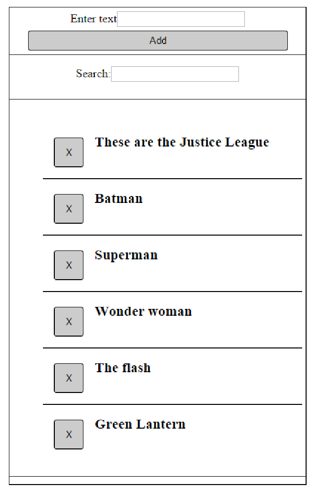
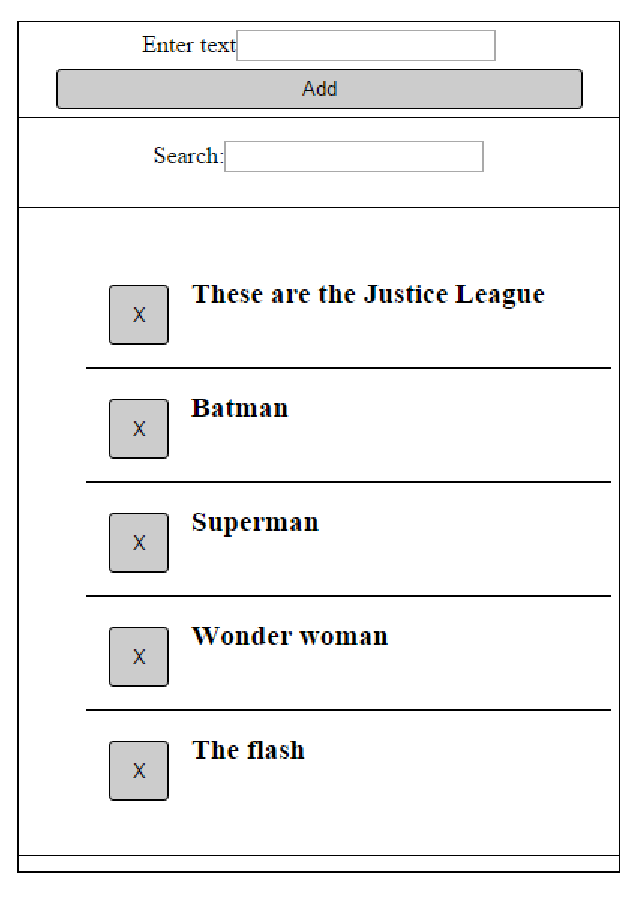
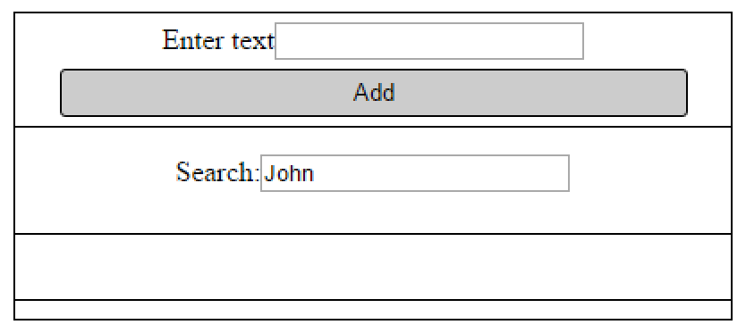

# Task 1 - Items control

Create a function that can add, search and remove items from a list

*   The function takes two parameters:
    *   A **selector** that can be any CSS3 selector: 
        *   By id -`#id`
        *   By class - `.class`
        *   By node type - `div`
        *   Or nested selectors - `#this .is a .nested.selector`
    *   A **isCaseSensitive** that sets the case-sensitivity of the search
        *   Possible values are `true` and `false`
        *   Has a default value `false`

The following must be implemented:

*   Adding an item
*   Removing an item
*   Searching items by a pattern
    *   The search can be either **case-sensitive** or **case-insensitive**

1.  **Adding elements** part must consist of an element with class `add-controls`, that contains:    
    *   Text "Enter text"
    *   An `input` element
    *   An element with class `button` and content 'Add'
    *   By clicking the element with class `button`, a new item element with class `list-item` should be added to the element with class `items-list` (_see 3. Result elements section__)        
        *   An element with class `list-item` must be added to the element with class `items-list`          

2. **Search elements** part must consist of an element with class `search-controls`, that contains:
    *   Text "Search"
    *   An `input` element
    *   Typing in the `input` must refresh the contents of the element with class `result-controls`
        *   Hides all the elements with class `list-item` that does not contain **the value** of the `input`
            *   The search can be either **case-sensitive** or **case-insensitive**, depending on the `isCaseSensitive` parameter
            *   **Hide the elements with display: none, otherwise, it will not be evaluated as correct!**
3. **Result elements** part must consists of an element with class `result-controls`, that contains:
    *   An element with class `items-list`
    *   The `items-list` element contains zero or many elements with class `list-item`
    *   Each element with class `list-item` contains of:
            *   A text, that is taken from the `input` in the element with class `add-controls`
            *   An element with class `button`, that has a content 'X' (capital 'x')
    *   By clicking any of the elements with class `button` in an element with class `list-item`:
        *   The element with class `list-item` that contains this `button` element, **must be deleted**

##Addintional remarks
*   Use `display: none` to hide elemens
*   Do not use `classList`
*   Do not use `innerText` or `textContent()`

_function template:_

        
    function solve(){
        return function(selector, isCaseSensitive){
            //your code here
        };
    }

_Example usage 1:_

    

    

_Example usage 2:_

    

    

_Examples:_ 

*   With some items added:

*   With search pattern, case-insensitive

*   After clicking the 'X' on "Green Lantern"

*   When no item matches the pattern

